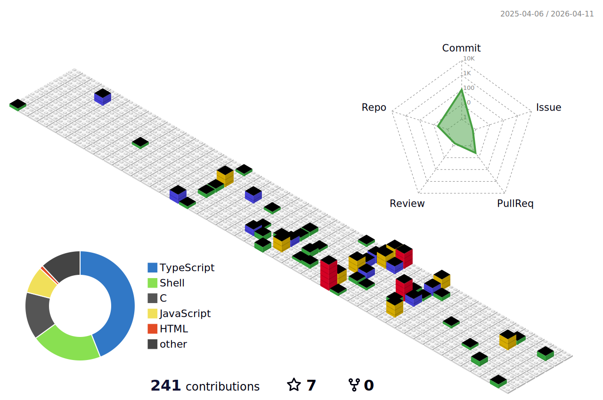

<!-- Center intro block -->

## 🔭 Currently learning cybersecurity  
🌱 A beginner in the handmade keyboard community  

### 📫 Let's Connect  

## ⚡ 2025 Goal

### 🎯 2024 → 2025 Semester Break
- 🛡️ Pursue the **ISC2 CC Certificate** ✅  
- 📖 Score **750+ on TOEIC** ❌ *(No time for exam)*  
- 🏴‍☠️ Complete more rooms on **TryHackMe** ❌ *(Ran out of subscription budget)*  
- 🌐 Strengthen **networking knowledge** ✅  
- 🔧 Learn **Cisco Packet Tracer, Splunk, and Kali tools** 🟨 *(No time for Splunk)*  
- ⌨️ Finish **trackball and keyboard builds** 🟨 *(Partially done but not so practical to use, though)*  
- 🧑‍🏫 Complete my internship without being beheaded by the professor 🟨 *(Done, learned a lot but got beheaded)*  

### 📘 1/2025
- 🥇 Place not worse than **150/250 teams** in Cyber Top Talent CTF  
- 📚 Survive **Stochastic Process**, **Microcontroller**  
- 🔐 Learn **CySA+** and prepare for $50 Beta exam late 2025  
- 💻 Go back to do some **basic CRUD website**  
- 📨 Spam internship enrollments!  

📌 *Disclaimer: Half of the above will not be achieved in time. << it's proven true*  

